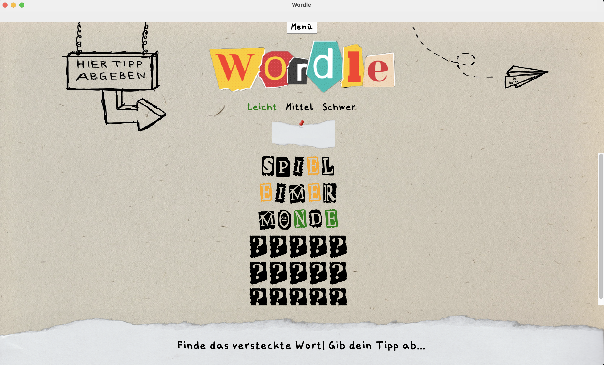
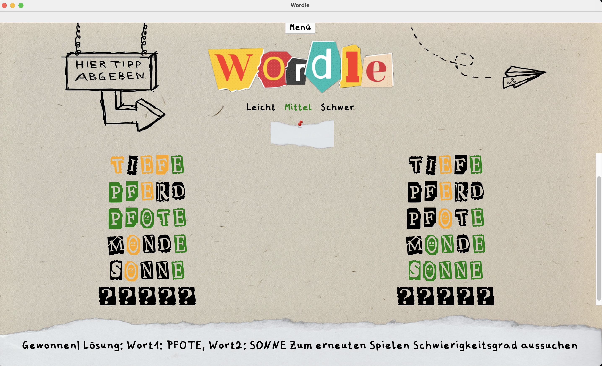
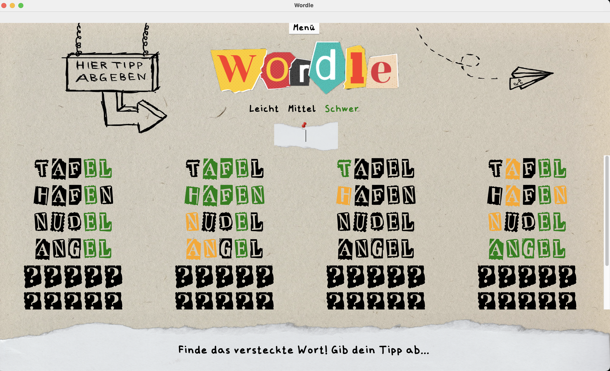
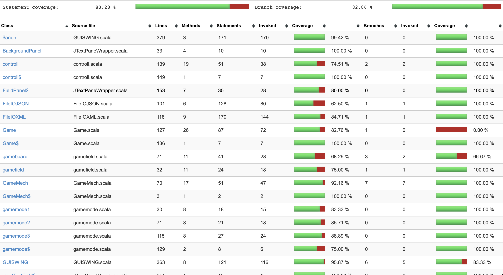
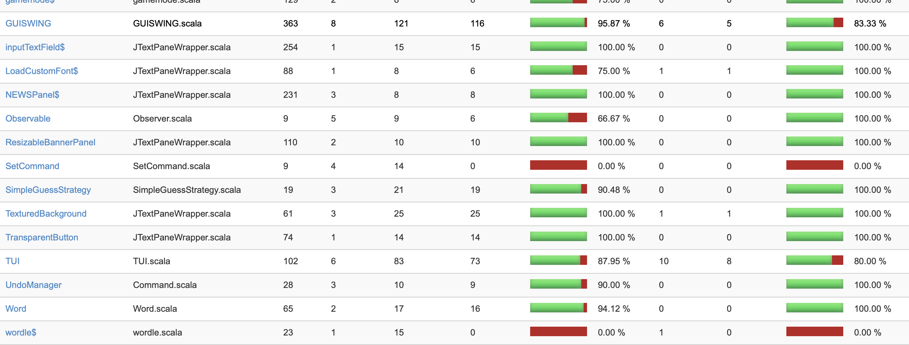

# Wordle
 

Wordle ist ein Rätselspiel, bei dem es darum geht, verborgene Wörter zu identifizieren. 
Deine Mission ist klar: Finde das versteckte Wort innerhalb einer limitierten Anzahl an Versuchen.

Bei jedem deiner Versuche erhältst du hilfreiche Hinweise in Form von gefärbten Buchstaben:

🖤Schwarz deutet darauf hin, dass ein Buchstabe nicht im Wort enthalten ist.

💛Gelb verrät dir, dass ein Buchstabe im Wort vorhanden ist, aber noch nicht am richtigen Platz.

💚Grün bestätigt, dass ein Buchstabe korrekt ist und genau dort hingehört.

Möchtest du deine Rätsel-Skills weiter herausfordern? Versuche dich an höheren Schwierigkeitsstufen, bei denen du mehrere Wörter gleichzeitig erraten musst. 

Viel Spaß! 

(Coverage Status hat aktuell einen Bug, bitte einmal auf Coverage Icon klicken um den echten zu sehen)

## Spielmodus Leicht

Das Wordle Original! Du suchst ein Wort und hast dafür sechs Versuche. Das Lösen sollte für dich kein Problem sein, falls doch, empfehlen wir dir noch einmal die Buchstaben zu üben.

## Spielmodus Mittel

Hier wird es schon interessanter. Behältst du den Überblick und kannst zwei Wörter gleichzeitig lösen?

## Spielmodus Schwer

Nur was für Wordle Maestros! Bezwingst du den Wordle Olymp? Falls ja, bist du ein ganz Großer.

## Tests

sbt clean coverage test
sbt coverageReport
(inklusive Testklasse der GUI)

  

  

 
 
